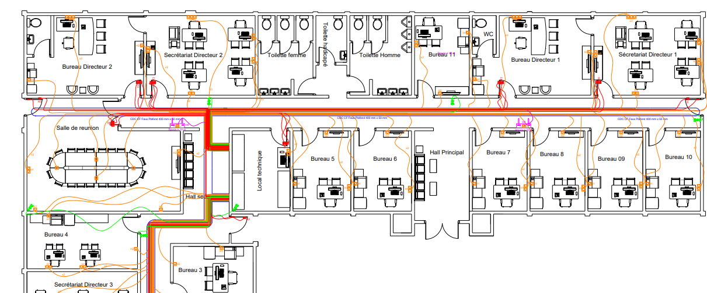

# 🛫 Plan Réseau & Télécom – Extension Bâtiment DG (ADC)

> Conception DAO d'un plan de câblage réseau complet pour l'extension du bâtiment de la Direction Générale des Aéroports du Cameroun (ADC), réalisée sous **AutoCAD 2024**.

**Maître d'œuvre :** M. Leonel Dutrochet Fotsing  
**Entreprise :** ETS Sciencia Business Group — Yaoundé, Cameroun  
**Région :** Ouest — Département de la Menoua

---

## 📋 Description du projet

Ce projet consiste en la conception du plan de réseau courant faible (CF) d'un bâtiment administratif de l'extension des ADC. Il couvre trois systèmes distincts :

- **Réseau informatique** — câblage RJ45 Cat6, panneaux de brassage, switches PoE, access points Wi-Fi
- **Vidéosurveillance IP** — caméras PoE, enregistreur NVR, stockage
- **Contrôle d'accès** — lecteurs de badge, boutons de sortie (RTE), contacts de porte

Le plan a été conçu avec une organisation en **calques distincts** par système, conformément aux bonnes pratiques DAO.

---

## 🗺️ Aperçu du plan



---

## 🗂️ Calques AutoCAD

| Calque | Contenu |
|---|---|
| Prises RJ45 & câbles données | Prises murales RJ45 Cat6 et tracé des câbles informatiques |
| Câbles Access Point | Câbles et emplacements des bornes Wi-Fi |
| Lecteur de Badge & autres | Lecteurs de badge, boutons de sortie RTE, contacts de porte |
| Câbles Lecteur de badge et autres | Câblage multi-conducteurs CF du contrôle d'accès |
| Caméras IP | Emplacements des caméras IP PoE |
| Câbles des caméras IP | Câblage RJ45 Cat6 dédié vidéosurveillance |
| Cartouche de légende | Légende, symboles, tableaux de listing et cartouche |

---

## 📦 Listing des équipements

### Réseau informatique
| Équipement | Quantité |
|---|---|
| Prises RJ45 Cat6 murales | 115 |
| Câbles Ethernet Cat6 | 1 336 m |
| Panneaux de brassage | 05 |
| Switch PoE 24 ports | 05 |
| Baie de brassage 19" | 01 |
| Cordons de brassage | 110 |
| Access Points Wi-Fi | 03 |

### Vidéosurveillance
| Équipement | Quantité |
|---|---|
| Caméras IP PoE | 07 |
| Switch PoE dédié caméras | 01 |
| NVR (enregistreur vidéo réseau) | 01 |
| Disques durs NVR | 02 |
| Câbles RJ45 Cat6 caméras | 230 m |

### Contrôle d'accès
| Équipement | Quantité |
|---|---|
| Contrôleur d'accès (4 portes) | 03 |
| Lecteurs de badge | 08 |
| Boutons de sortie (RTE) | 11 |
| Contacts de porte | 11 |
| Câbles multi-conducteurs CF | 610 m |

---

## 🏢 Espaces couverts

| Zone | Détail |
|---|---|
| Aile nord | Bureau Directeur 1 & 2, Secrétariats, Bureau 11 |
| Aile centrale | Hall principal, Hall secondaire, Bureaux 5 à 10 |
| Aile sud | Bureau Directeur 3, Secrétariat, Bureaux 1 à 4 |
| Communs | Salle de réunion, Local technique, Sanitaires |

---

## 🔑 Légende des hauteurs de pose

| Code | Hauteur | Usage |
|---|---|---|
| H1 | 0,30 m | Prises basses (sol) |
| H2 | 1,50 m | Prises hautes (bureau) |
| H3 | 1,10 m | Caméras & contrôle d'accès |
| H4 | 2,50 m | Équipements en hauteur |
| BT | — | Bouton de sortie |

---

## 📁 Structure du dépôt

```
plan-reseau-adc-cameroun/
│
├── src/
│   └── plan-adc.dwg                          # Fichier source AutoCAD
│
├── exports/
│   ├── plan-general.pdf                      # Plan général
│   ├── calque-access-point.pdf               # Calque câblage Wi-Fi
│   ├── calque-cameras-ip.pdf                 # Calque vidéosurveillance
│   ├── calque-lecteurs-badge.pdf             # Calque contrôle d'accès
│   └── calque-rj45.pdf                       # Calque réseau informatique
│
├── .gitignore
└── README.md
```

---

## 🛠️ Outils utilisés

- **AutoCAD 2024** (LMS Tech) — conception DAO, gestion des calques, cotations, cartouche

---

## 👤 Auteur

**NDJOCK NJAP JEREMIE LEVY**  
Ingénieur Système-Réseaux-Télécommunication/Sécurité des systèmes de communication


---

## 📄 Licence

Ce projet est partagé à des fins éducatives et de démonstration.
